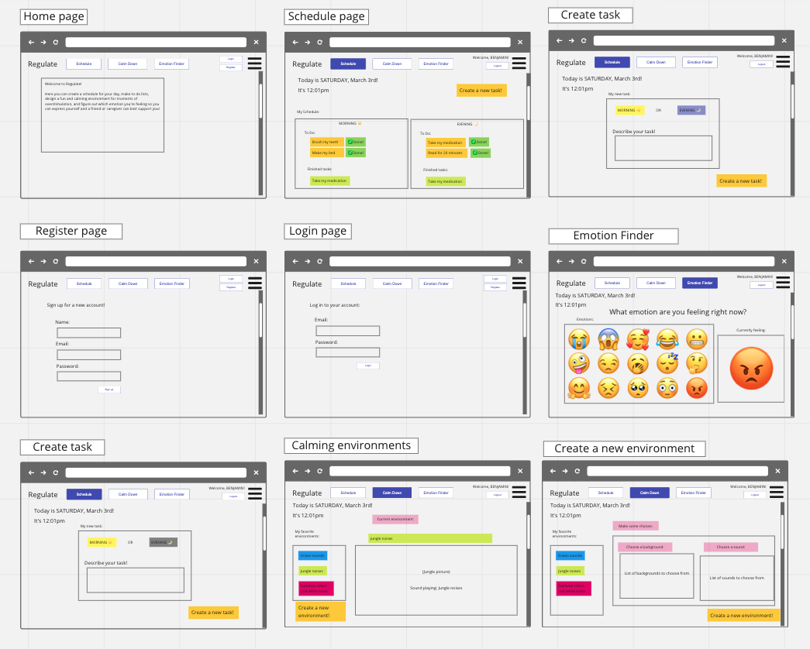

# Welcome to the *Regulate* App!

## Tech stack used:
* Typescript?
* React
* Next
* Node?
* Mongo vs. Psql?

I haven't learned Typescript or Next.js yet but I plan to spend some time learning the very basics in the first day or two of the project time and then implementing these frameworks for the app development. I specifically chose Typescript and Next.js because they are popular technologies used in the industry and I want to add them as tools in my software engineering toolbelt.

## Description

Having and maintaining a consistent routine and daily structure is vital to making a child with special needs such as autism feel safe, supported, and regulated. This is an app designed for these children to help them practice good habits that promote independence. Habits include managing a schedule and completing important daily tasks, developing healthy coping strategies for times of frustration or overstimulation, and identifying specific emotions in order to express themselves and their needs better.

3 main elements:

1. Daily schedule and to-do list
    - Tasks for both night and day

2) Calming environment creator
    - Choose between an array of background and sound options

3) Emotion identifier
    - Given a visual list of emotions that they can pick to describe their current emotion

## Wireframes of the app

## User Flow and User Stories
* As a user, I want to create my own account with a login and password
* As a user, I want to create daily tasks under my overall "schedule" and check these tasks off as I go throughout the day
* As a user, I want to create a calming environment that I can access at times of stress
* As a user, I want to be able to quickly identify emotions that I don't have words for, using pictures

## Daily Sprints

Friday: learning typescript and Next.js, finishing readme and RESTful routing charts and ERDs

Saturday: Getting basic functionality, create main structure of app

Sunday: Working on user auth and login/logout functionality, connect backend with frontend

Monday: Work on new task creation functionality

Tuesday: Hopefully reach MVP, do basic styling

Wednesday: Stretch goals

Thursday: Final edits and styling

## RESTful routing and ERDs

I'm waiting on these because I'd love some feedback on my preliminary pitch first before I dive into creating routing charts and database models.

## MVP
* Users can create an account with username and password
* Users can log in and out of their account
* Users can add new tasks to their database
* Users can see a list of their 'to-do' tasks with the ability to check off a task as completed

## Stretch goals
* Users can delete a to-do task
* Emotion finder functionality
* Calming environment functionality with the ability to create a new environment element
* Animations instead of static images for background choices for environments
* Fun, colorful, calming styling